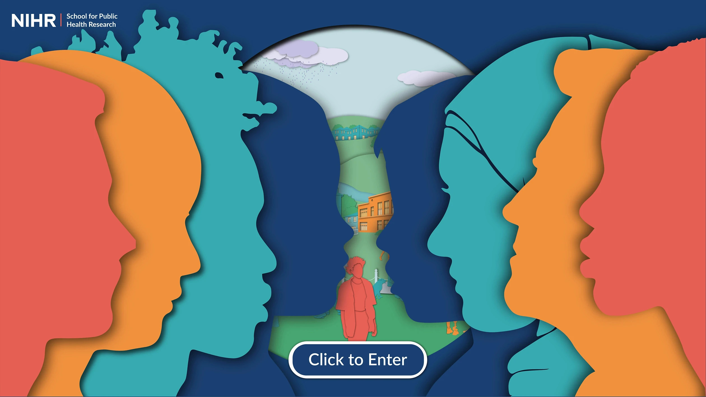

```{r setup, include=FALSE}
knitr::opts_chunk$set(echo = TRUE)
```

Public mental health affects everyone and is impacted my numerous factors. Bringing these determinants together in a single conceptual framework was one of the major projects I worked on in the [School for Public Health Research (SPHR)'s Public Mental Health Programme](https://sphr.nihr.ac.uk/category/research/public-mental-health/). 

```{r featured, echo=FALSE, out.width="75%", fig.cap="", fig.align='centre'}

```

## Why did we do this study? 
Numerous determinants have been linked to public mental health; however, they have not been brought together in a comprehensive conceptual framework. 

The goal of this work was to bring together academic research, practitioner expertise, and public perspectives to create a public mental health conceptual framework.


## What did we do?
We first identified a comprehensive list of potential determinants in an academic literature review (Thanks Olivia!), reviewed policy documents and reports, and worked with members of the public (including our peer researchers) to identify what they thought were the key factors that impact mental health. 

We brought this huge list to in-person and online consultations with academics, public health practitioners, policy makers, and members of the public to review the potential determinants to identify any missing factors, and prioritise the determinants.

In the end, we identified 55 determinants, which we organised into 4 levels: individual, family, community, and structural.

We then conducted rapid reviews to define each determinant and to identify key research, interventions, and resources (thanks Paula!). We then worked with a marvelously talented design team (Laura, Bobbie, & Mylene) to visualise the framework and create an [interactive conceptual framework](https://www.publicmentalhealth.co.uk/).


```{r levels, echo=FALSE, out.width="75%", fig.cap="", fig.align='centre'}
knitr::include_graphics("pmh_levels.jpg")
```

## What does it mean?
I am particularly excited about this tool as it has the potential to raise awareness about the broad factors which influence mental health. The interactivity is a real strength of this tool, showing both how interconnected the determinants are, and allowing you to explore the framework in many different ways, including getting a broad view of the determinants of mental health, to exploring specific research and interventions relevant to a topic of interest. 

## Read more
We published details of the process of creating the framework in BMC Public Health. Read the full version here: [open access] (https://bmcpublichealth.biomedcentral.com/articles/10.1186/s12889-022-13775-9)

## Video
If reading a paper isn't your thing, we recorded a brief video walking through the framework. Check it out on [Youtube](https://www.youtube.com/watch?v=NFQbSQKkr-4).


