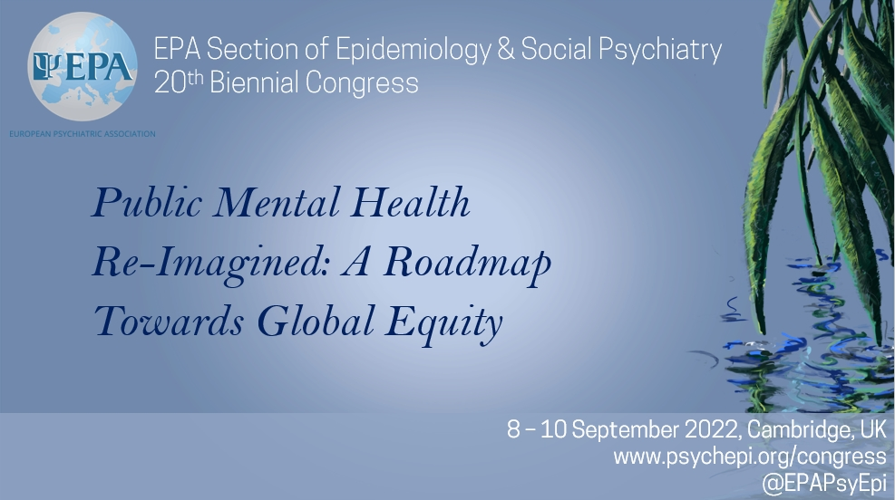
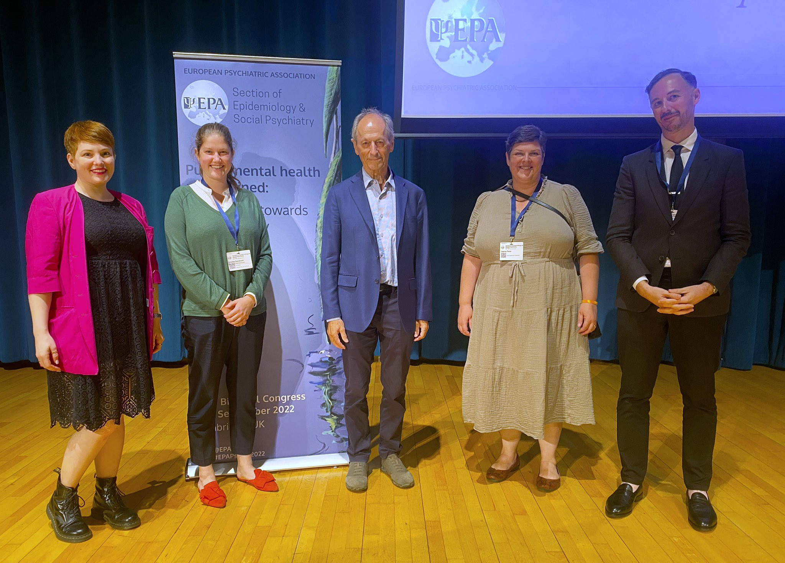
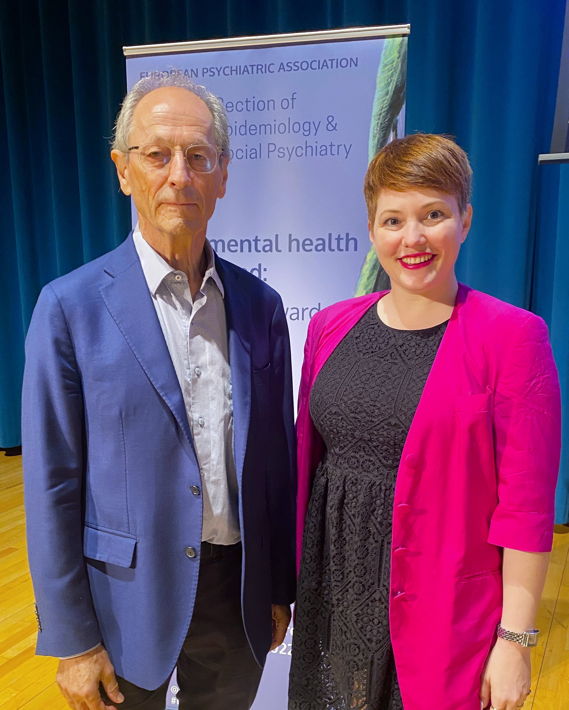
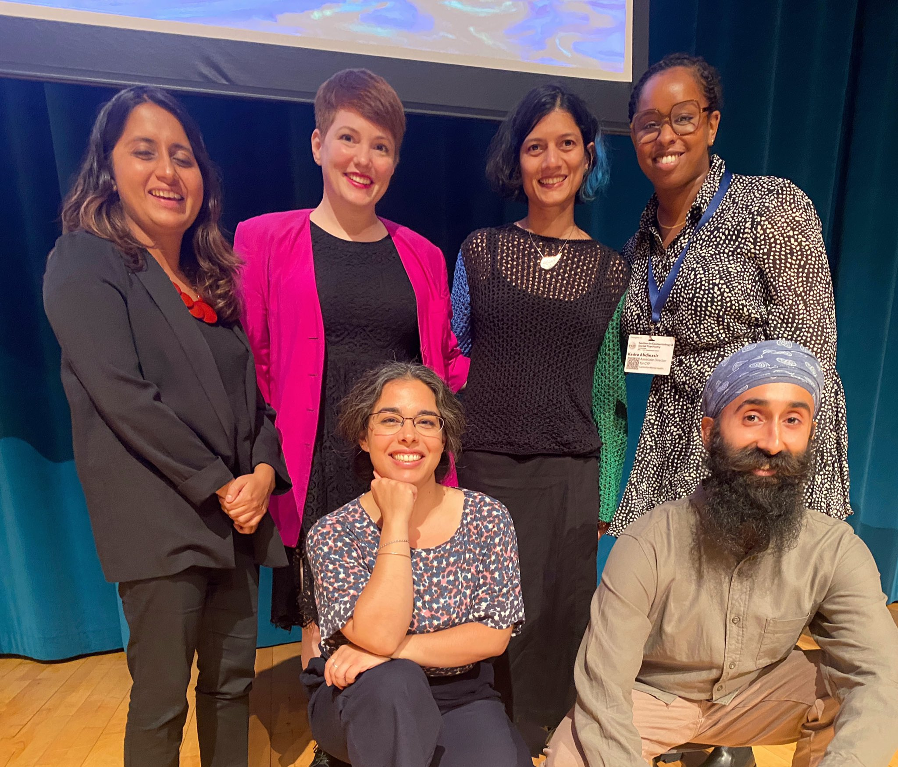
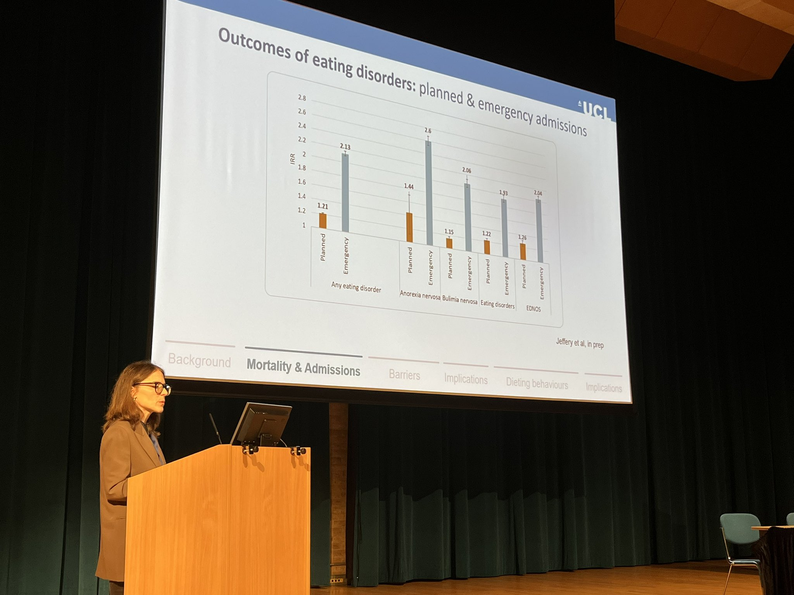
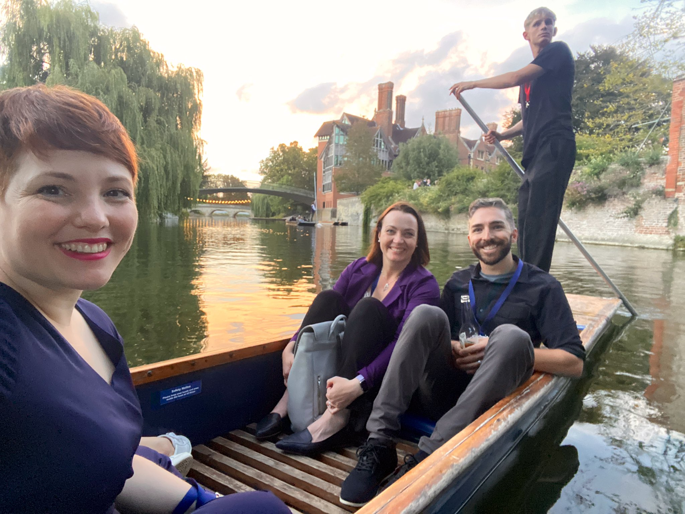

```{r, echo=FALSE, out.width="75%", fig.align = 'center'}

```

## EPA Epidemiology and Social Psychiatry - 20th biennial congress
The year was 2018 (I think?). Covid was but a twinkle in no one's eye, and we naively agreed to coordinate a conference. 

Initially, we were hoping to welcome delegates to Cambridge in 2020, but there was something else that had rather monopolised the world, so the Local Organising Committee Chair (James Kirkbride) prudenty postponed the meeting until Sept 2022. 

After many months of planning, James Kirkbride, Emma Soneson, Joana Pato-Aithal, and I pulled off a magnificant conference. 

```{r, echo=FALSE, out.width="75%", fig.align = 'center', fig.cap="Local organising committee with Marmot (Jen, Emma, Michael, Joana, James), EPA 2022"}

```


##Public mental health re-imagined: a roadmap towards global equity
We brought together renowned keynote speakers (Prof Peter Jones! Prof Ian Colman! Prof Sir Michael Marmot! Prof Inez Myin-Germeys! Prof Ann John), and had a strong line up of presentations, posters, and panels. A psych epi nerd's dream! (You can see the whole scientific programme on our [conference site](https://www.psychepi.org/congress/)).

## Highlights
In a week of highlights, here were a few of my favourite moments. 

# 1. Chairing the plenary session of a legend
One of the perks of being a member of the local organising committee is to suggest who might be our dream speakers. And sometimes they say yes! Fast forward 3 years, and I found myself on the mainstage introducing one of my public health heros, Professor Sir Michael Marmot. 

His research over the past 40 years has transformed the conversation about health inequalities and has inspired a generation of public health researchers working to understand and address inequalities. 


```{r, echo=FALSE, out.width="75%", fig.align = 'center', fig.cap="Prof Sir Michael Marmot & Jen Dykxhoorn, EPA 2022"}

```

# 2. Sitting on a panel packed with inspiring voices discussing mental health inequalities (and what we can do)

```{r, echo=FALSE, out.width="75%", fig.align = 'center', fig.cap="Panellists for Mental Health Question Time - Praveetha Patalay, Jay Das Munshi, Kadra Abdinasir, Suranjeet, Sarah Joy, and Jen Dykxhoorn  (not picutred: Michael Marmot)"}

```

This panel discussion was live-tweeted and live-streamed by the Mental Elf. You can check out a great summary here: [Big Twitter thread](https://twitter.com/Mental_Elf/status/1568262342500024320)
or watch the entire discussion on the [Mental Elf Youtube Channel](https://www.youtube.com/watch?v=McL8VZAZ-O8).


# 3. Watching others shine! 
One of the truly wonderful parts of mentoring ECRs is watching them develop as researchers. This year, I got to see one of my previous fellows, Kate Dotsikas, be recognised as an honourable mention for the ECR presentation prize. 

I also got to watch many of my collegues and friends take the stage, giving keynotes, oral presentations, and rapid fire talks that were eloquent and inspiring. 
```{r, echo=FALSE, out.width="75%", fig.align = 'center', fig.cap="Dr Francesca Solmi from UCL delivering a brilliant keynote on eating disorders"}

```

# 4. Reconnecting with friends and collaborators 
Conferences aren't all lecture halls and power points. Some of the best conversations are had in a boat or over a glass of wine. It was truly wonderful to re-connect with so many friends and meet new ones over the week, which was particularly sweet after the years of closed borders, lockdowns, and zoom calls that have become so familiar. There is something special about being together again that even the best wifi connection and zoom link cannot replicate. 

```{r, echo=FALSE, out.width="75%", fig.align = 'center', fig.cap="Punting with some Canadian pals: Drs Kelly Anderson & Jordan Edwards"}

```

```{r, echo=FALSE, out.width="75%", fig.align = 'center', fig.cap="Harry Potter-style elegance with Dr Jean Stafford"}
knitr::include_graphics("harrypotter.jpeg")
```

While I was coasting on a potent mixture of adrenaline and caffeine by the end of the week, I am feeling re-energised following this conference and ready jump back into my research.  
