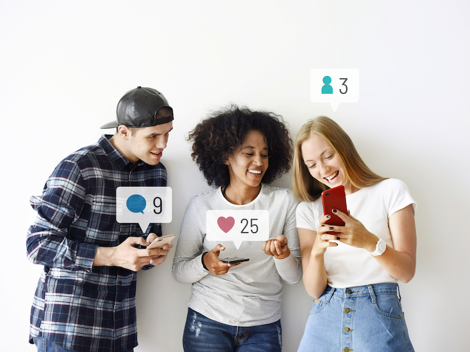
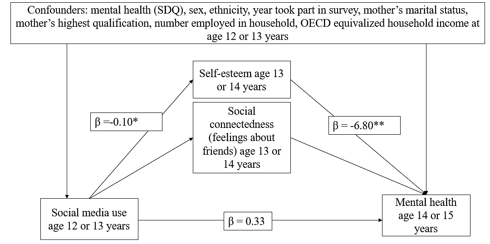

```{r, echo=FALSE, out.width="75%", fig.align = 'center', fig.cap="Is social media use driving mental health problems in young people?"}

```

## Why did we do this research?
It is not a new refrain - worried parents wondering if social media is turning their kids  social media is turning our kids brains to mush and creating a generation of anxious and depressed adolescents.  

The huge increase in social media use in recent decades seems to correspond to the high rates of mental health probvlems in young people. While it seems easy to blame the high rates of mental disorders in young people on social media, research on this relationship has been inconsistent. Some studies have linked social media use to depression, anxiety, and psychological distress, while others have highlighted that social media may improve mental health through higher social support, stronger bonds, and reduced loneliness. 

Importantly, few of these studies used longitudinal data, which means they were not able to see if the social media use came before developing mental health problems. 

## Research question
What is the association between social media use and later mental health problems in adolescents? 

## What did we do? 
Using data from [Understanding Society](https://www.understandingsociety.ac.uk/), we included 3,228 young people who had answered questions about their social media use at the ages 12-13. We followed these young people for two years and measured their mental health at ages 14-15. 


```{r, echo=FALSE, out.width="75%", fig.align = 'center', fig.cap="Self-esteem as a mediator in the relationship between social media use and mental health"}

```

## What did we find? 
Overall, most 12-13-year-olds reported some social media use on weekdays (74.3%) with over 10% reporting using 4 hours or more per day. 


We found that more time spent on social media at ages 12-13 was not associated with mental health problems at ages 14-15. 

The unadjusted model showed a relationship between increased social media and more mental health problems, but this relationship was fully attenuated once we accounted for sex, ethnicity, baseline mental health, and other covariates. Most of the relationship could be explained by mental health problems at baseline.

We found that self-esteem partially mediated this relationship, but once we accounted for important baseline variables, this relationship was also fully attenuated. 


## What does this mean?
This research shows that there is little evidence of a relationship between social media and developing mental health problems. 

From a methodological perspective, it also shows the importance of using longitudinal data, as the longitudinal findings consistently find little evidence for a link between social media and adolescent mental health, while many cross-sectional studies find a negative relationship between social media use and mental health.

This finding also questions mental health interventions which aim to reduce social media usage in order to improve mental health in young people. The lack of a longitidnal association suggest that these interventions are unlikely to be an effective way to improve mental health and reduce mental disorders in young people. 

[Read full-text article](https://www.jmir.org/2023/1/e43213/). 

## Behind the research
This research was led by [Dr Ruth Plackett](https://www.ucl.ac.uk/epidemiology-health-care/ruth-plackett) during her post-doctoral launching fellowship from the NIHR School for Public Health Research. She has gone on to secure another fellowship to continue her mental health research. 

 


