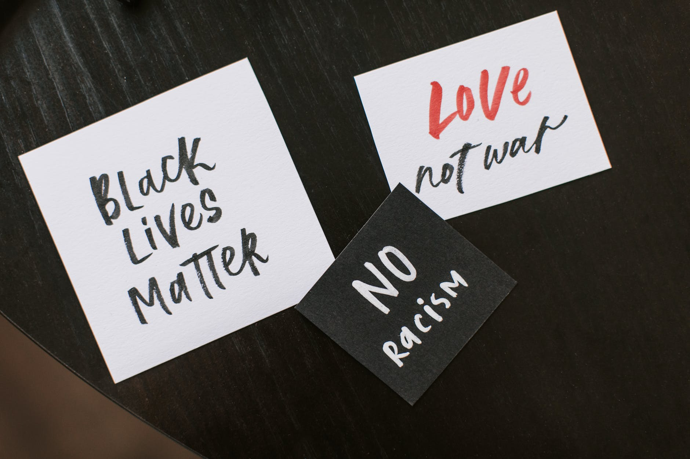

For the past two years, I have been the programme manager and senior research fellow on a large programme of research aimed at generating evidence for public mental health. As with many projects, it always takes time before you can see the fruits of all of the work. I am delighted that our first papers are coming out now, with more exciting stuff to follow. 

```{r, echo=FALSE, out.width="75%", fig.align = 'center', fig.cap="Mental health interventions for ethnic minoritised groups, Photo: V Karpovich on Pexels.com"}

```


## Why did we do this research?
We wanted to see what community-based interventions exist to improve the mental health of adults from ethnic minority groups.


## What did we do? 
We conducted a scoping review of studies on the effectiveness of community-centred interventions designed to improve the mental health and well-being of adults from ethnic minority groups in the UK.

We searched six electronic academic databases for studies published between January 1990 and September 2019: Medline, Embase, PsychINFO, Scopus, CINAHL and Cochrane

## What did we find? 
Our preliminary searches identified 4,501 studies, but only 7 met the eligibility criteria: 
- four randomised controlled trials, 
- one pre/post-pilot study, 
- one cross-sectional study,
- one ethnographic study. 

Interventions included therapy-style sessions, peer-support groups, educational materials, gym access and a family services programme. 

Common components included a focus on tackling social isolation, using lay health workers from within the community, signposting and overcoming structural barriers to access. 

Four studies found that the intervention improved mental health outcomes. 

However, 6 studies were assessed as having a "high risk of bias." Studies with a high-risk of bias have flaws or issues in the design or analysis which means that we cannot be confident in the results of these studies.   

## What does this mean?
Despite clear evidence showing that people from ethnic minority groups tend to experience more mental health problems due to structural and institutional risk factors, we found that there were few interventions which have been designed to improve mental health in this population. 

This review highlighted that we need to continue to design and evaluate interventions for ethnic minority populations in order to have the high-quality evidence needed to guide public health practice and policies. 

This paper is Open Access, so you can read the full paper here: [Mental health interventions for ethnic minoritised groups](https://bmjopen.bmj.com/content/11/4/e041102.full)


 


