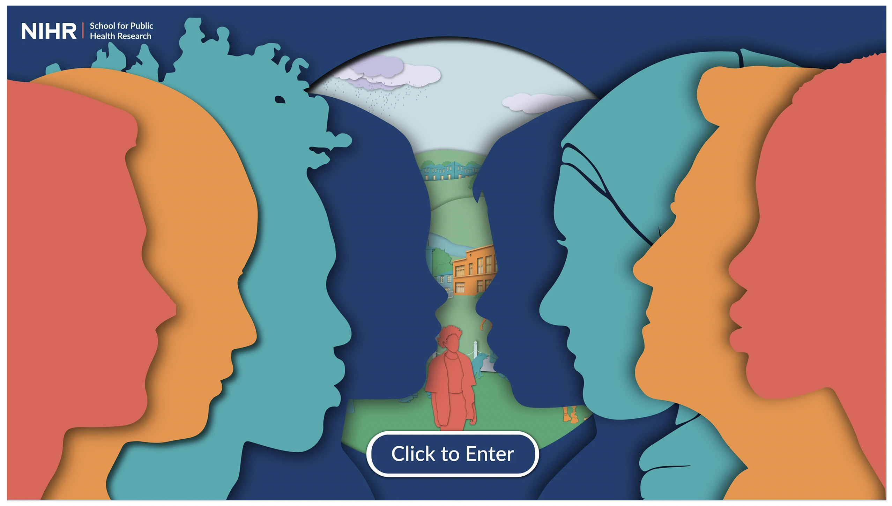
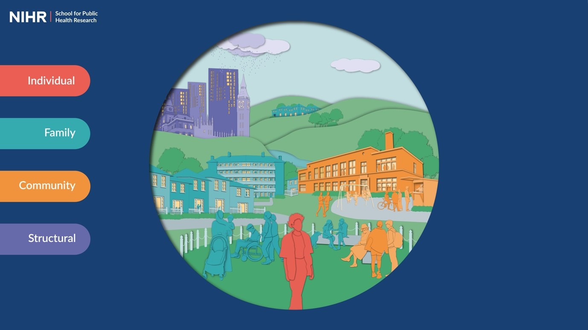

```{r setup, include=FALSE}
knitr::opts_chunk$set(echo = TRUE)
```

### Background 

For the past 3 years, I have been the programme manager for the NIHR School for Public Health Research's [Public Mental Health Programme](https://sphr.nihr.ac.uk/category/research/public-mental-health/). 

An important part of this programme was to develop a conceptual framework of the factors which impact our mental health. 

```{r, echo=FALSE, out.width="75%", fig.cap="", fig.align='centre'}

```

### Aim

The aim of this tool is to summarise the current evidence around key factors (also known as determinants) that affect public mental health.

The conceptual framework aims to provide information that is relevant and useful to members of the public, public health practitioners, and academics.

### What did we do?

We reviewed academic literature, policies, and reports which discussed the determinants of mental health. We also worked with members of the public, practitioners, and academics to identify a comprehensive list of determinants. 

These were prioritised into a list of 55 determinants. With the help of an amazing research intern, we defined each determinant and collected key resources demonstrating the link between each factor and mental health. 

And then they were made beautiful by our talented team of designers, lead by [Laura Fischer and Bobbie Galvin](https://sphr.nihr.ac.uk/news-and-events/visualising-public-mental-health/). 

```{r, echo=FALSE, out.width="75%", fig.cap="", fig.align='centre'}

```

### What can the tool be used for? 

The tool can be used to inform policy and practice, advance people’s knowledge of mental health, and help identify further opportunities for research.

### Check it out for yourself! 

## [www.publicmentalhealth.co.uk](https://www.publicmentalhealth.co.uk/)

### Read more
We also published a paper that provides WAY more details of what we did and how we did it! You can read the [full text, open-access paper here](https://bmcpublichealth.biomedcentral.com/articles/10.1186/s12889-022-13775-9).


## Sidebar:
If reading papers is not your thing, you can watch a brief video where I give a tour of the framework on [Youtube](https://www.youtube.com/watch?v=NFQbSQKkr-4).
