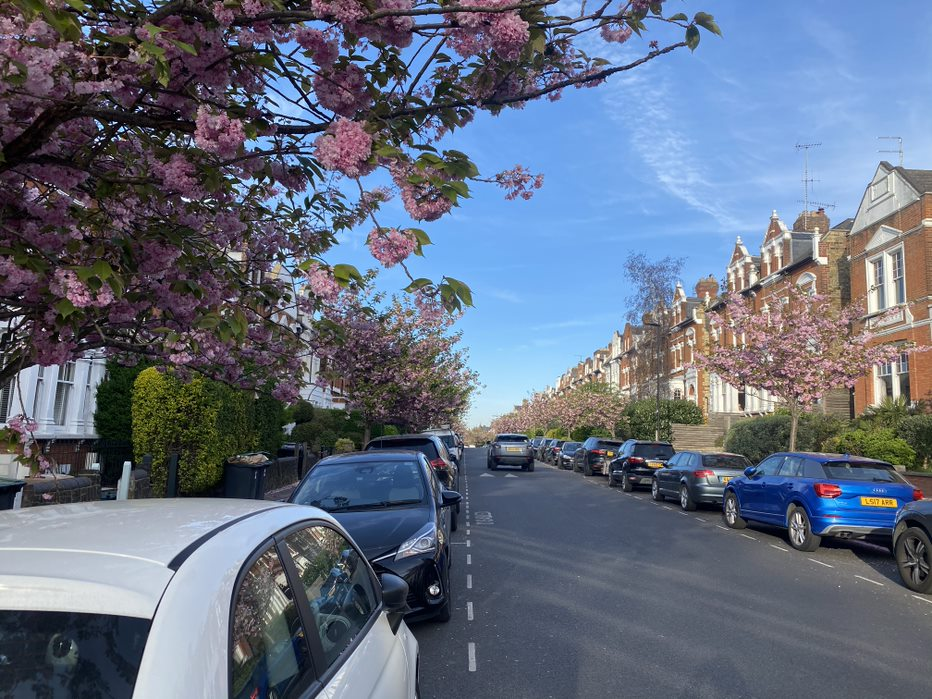

```{r, echo=FALSE, out.width="100%", fig.align = 'center', fig.cap=" "}

```

### Background

Improving public mental health, promoting well-being, and preventing mental illness is a major priority for public health in the UK. Importantly, communities can play an important role in providing public mental health interventions which target key determinants of mental health. 


### Why did we do this research? 

Mapping available community-based mental health interventions can show us what is currently available across England, what do these interventions look like, and see if available services align with mental health needs. 

This research was part of the [NIHR School for Public Health Research's Public Mental Health Programme](https://sphr.nihr.ac.uk/category/research/public-mental-health/) research programme. This work was lead by Dr Fiona Duncan (Durham University) and Michael McGrath (UCL), with support from across the Public Mental Health Programme. 

### What did we do? 

Normally I would jump into a brief summary of what we did, what we found, and why it matters, but the [Mental Elf](https://www.nationalelfservice.net/mental-health/) published a terrific summary of this work on their blog today, including an overview of the research, the limitations, and next steps. 


### Read more

Our paper was published in [BMC Public Health - open access](https://bmcpublichealth.biomedcentral.com/articles/10.1186/s12889-021-11741-5)


