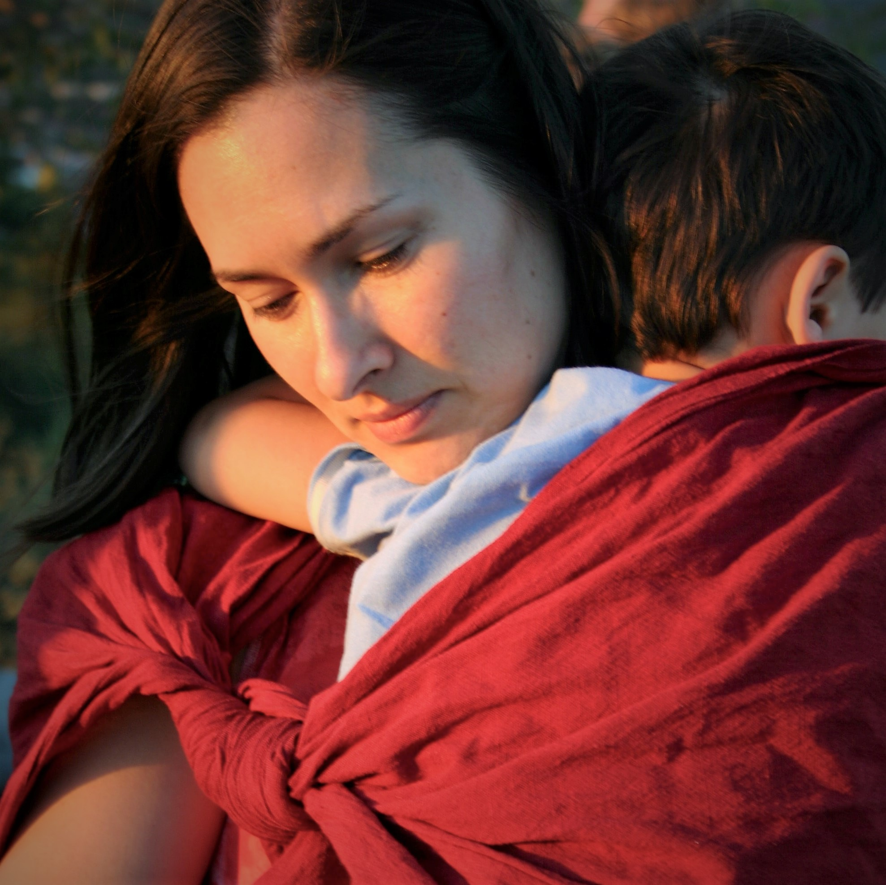

```{r, echo=FALSE, out.width="75%", fig.align = 'center', fig.cap="From unsplash.com "}

```

## Why did we do this research?
Becoming a parent is thought to reduce the risk of suicide, but there are many questions, including does this protective effect change over the life course and if it is different for men and for women.


## What did we do? 
In this study, we used data on over 5 million Swedish women and men from 1991 to 2011.

We used the linked national registers to identify the birth or adoption of children and other important confounding factors. We used the national death registry to identify people who died by suicide. 

In order to assess the risk of suicide, we used survival analysis (Cox regression).

## What did we find? 
Parents had a lower risk of suicide than non-parents across the life course. This reduction in suicide risk was most pronounced for younger parents, particularly young women.These results are consistent with possible mechanisms, like sense of responsibility and higher levels of connectedness, which may be protective against suicide in parents.

```{r, echo=FALSE, out.width="75%", fig.align = 'center', fig.cap="Association between parenthood and suicide risk in women and men, by age"}
knitr::include_graphics("fig1.jpg")
```


[Read full-text article](https://link.springer.com/article/10.1007/s00127-022-02321-y#Fig2). 

