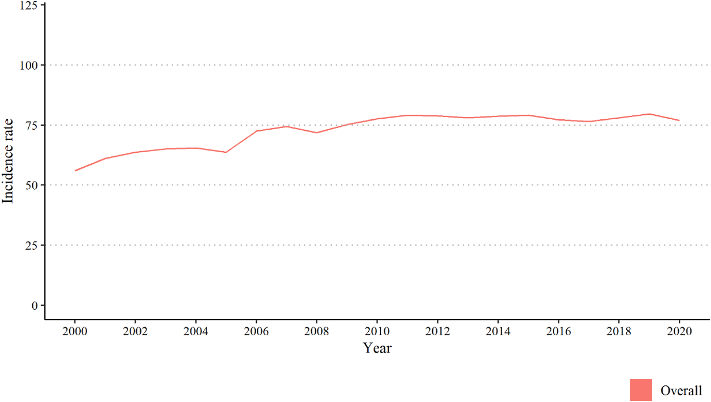

```{r, echo=FALSE, out.width="100%", fig.align = 'center', fig.cap="Automat by Edward Hopper (1927)"}
knitr::include_graphics("featured.jpeg")
```

### Background 
Common mental disorders, including anxiety, depression, and stress-related disorders affect millions of people each year. 

In the UK, primary care doctors (general practitioners or "GPs") diagnose and treat individuals with common mental disorders, which might include pharmaceutical treatment or referrals to talking therapies like cognitive behavioural therapy or counselling.

### Why did we do this research?
The last 20 years have been a period of tremendous change in the UK, so in this research, we explored rates of new cases of common mental disorders ("incident" cases) over time. This research also looked at trends within different groups to see if the patterns were different for females/males, age groups, ethnicity, geographic region, or level of deprivation.  

### What did we do? 
We used the electronic health records of over 29 million UK adults registered to primary care. 

We followed individuals from 2000 through 2020, starting at the date they first registered to primary care or when they turned 16 years old.  

We looked to see if they had any record of common mental disorders in their primary care records. This included: 

+ symptoms or diagnosis of anxiety disorder, depressive disorder, or stress

+ pharmaceutical treatment for anxiety or depressive disorders (e.g. antidepressants or anxiolytics) 

We calculated the incidence rate of common mental disorders, by 1,000 person-years. We looked at the rates of common mental disorders overall, as well as by sex (female, male), age (10-year age groups), ethnicity, nation (England, Scotland, Northern Ireland, Wales), physical comorbidity, and area-level deprivation. 


*What do we mean by "incident" cases:* We were interested in "new" or "incident" cases of common mental disorders. The first record of common mental disorder was considered an "incident" episode. As mental disorders are commonly recurrent or episodic over the life course, we also classified an individual as having an incident episode of CMD when a new CMD episode was recorded in their primary care records where they had not received any treatment for mental disorders in the 12 months prior. 


### What did we find? 

We found the overall incidence of common mental disorders increased from 55.9 per 1,000 person years in 2000 to 79.6 per 1,000 person-years in 2019. 

```{r, echo=FALSE, out.width="75%", fig.align = 'center', fig.cap="Recorded annual incidence rate of common mental disorders (per 1000 person-years), overall"}

```

Rates of common mental disorders were higher among females than males across all time points. We found interesting patterns by age group. The incidence rate in those aged 16-24 years experienced a more than two-fold increase between 2000 and 2010. We saw a similar increase in those aged 25,34, but not as pronounced. In contrast, incidence rates were stable in those aged 35-44, and decreased for older age groups. 

```{r, echo=FALSE, out.width="75%", fig.align = 'center', fig.cap="Recorded annual incidence rate of common mental disorders (per 1000 person-years), by age"}
knitr::include_graphics("age.png")
```

We also looked at the rates over time by ethnic group, UK nation (England, Scotland, Northern Ireland, and Wales), geographic region, area-level deprivation, and physical comorbidities, revealing interesting patterns. 


### What does this mean? 

We found that there was an increase in the incidence of common mental disorders recorded in primary care in the UK over the past 20 years. However, these patterns were different across population groups. 

This study provides a high-level overview of rates over time, which is important for public health planning and policy. 

However, this research was not able to identify why these changes have occurred. For example, incidence may increase for several reasons: 

1.    A genuine rise in anxiety, depression, and stress symptoms; 

2.    Changes in help-seeking behaviours, including increased rates of consulting with GPs for mental health concerns; or 

3.    Changes in diagnosing, prescribing, and recording mental health symptoms and diagnoses in general practice.

More research is required to understand what is underlying these trends and what needs to be done in order identify and treat those with common mental disorders. 


### Read more 

The full article was published open-access in Psychological Medicine and is available
[here](https://www.cambridge.org/core/journals/psychological-medicine/article/temporal-patterns-in-the-recorded-annual-incidence-of-common-mental-disorders-over-two-decades-in-the-united-kingdom-a-primary-care-cohort-study/5FDB89622CEED13B8538CAA28E837144)

### Do you have questions about common mental disorders? 

Click here if you want to learn more about the symptoms and treatment of common mental disorders like [anxiety](https://www.nhsinform.scot/illnesses-and-conditions/mental-health/anxiety) or [depression](https://www.nhsinform.scot/illnesses-and-conditions/mental-health/depression).  