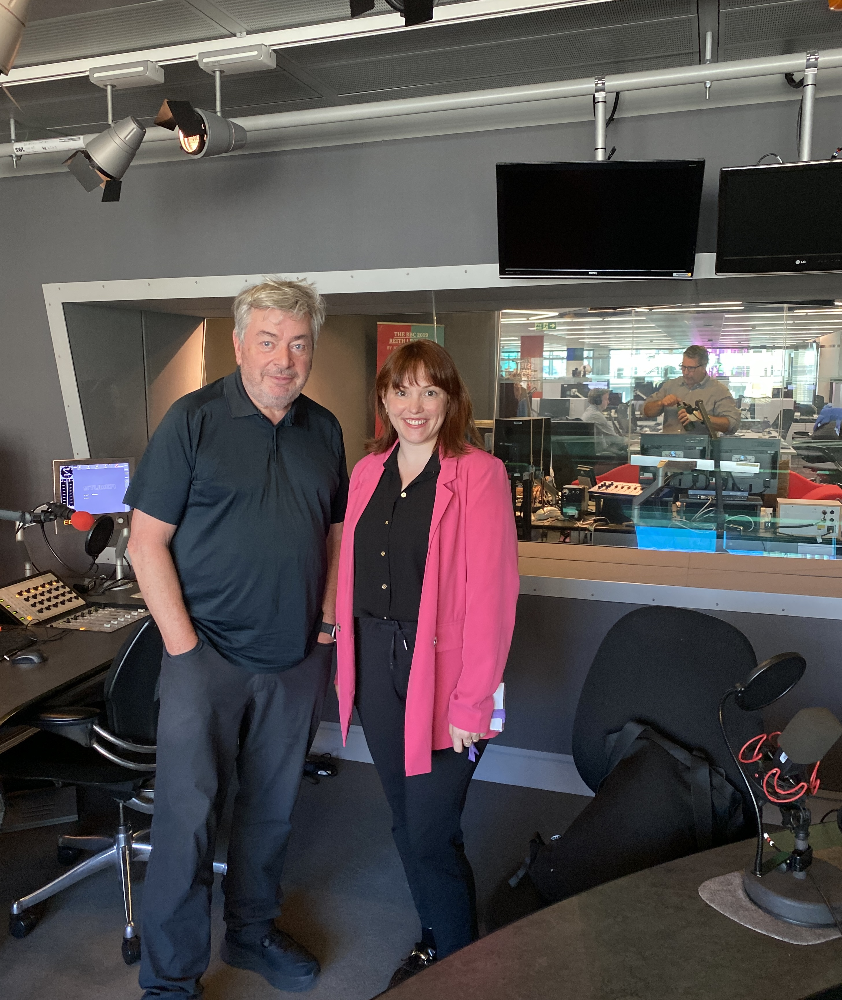

```{r, echo=FALSE, out.width="75%", fig.align = 'center', fig.cap="Heading to BBC studio"}
knitr::include_graphics("featured.jpg")
```

## Background


```{r, echo=FALSE, out.width="75%", fig.align = 'center', fig.cap="David Aaronovitch in studio with Jen Dykxhoorn"}

```

## What does this mean? 


## Key papers
[Temporal trends of common mental disorders You can read the full, open-access paper] (https://www.mentalhealthepi.com/blog/10_incidence/). 


```{r, echo=FALSE, out.width="75%", fig.align = 'center', fig.cap="With David Aaronovitch in the studio for BBC Briefing Room taping"}

```

