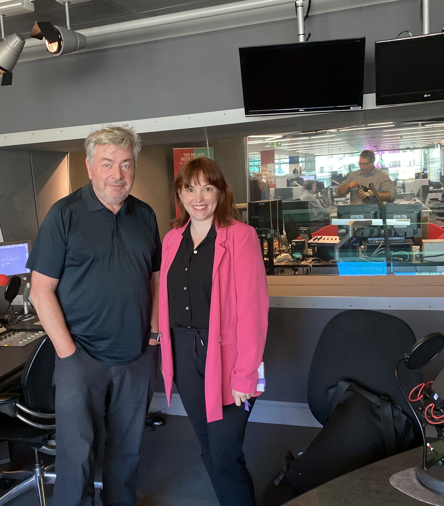
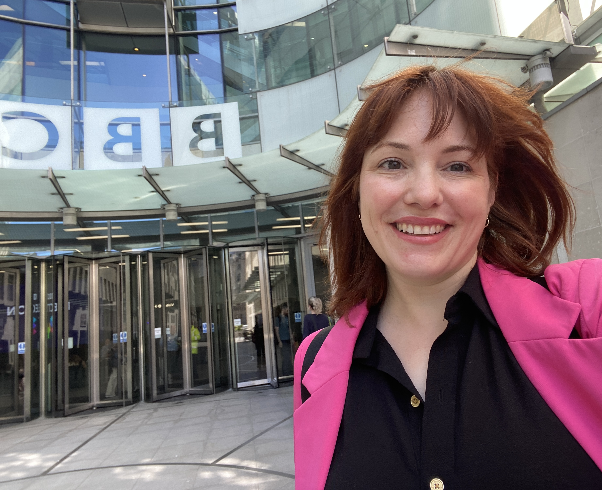

```{r, echo=FALSE, out.width="75%", fig.align = 'center'}

```

### Background 
The Briefing Room is a programme where David Aaronovitch invites experts to explore the big issues in the news. In a special 4 part series on health, Aaronovitch looked to explore the recent increase in mental health problems like anxiety and depression. 

I was invited to participate in the expert panel, alongside Prof Jennifer Wild, Dr Sharon Neufeld, and Prof Thalia Ele to discuss the research and what they mean. 

It was a fantastic conversation, and a true pleasure to get a chance to go to the BBC Broadcasting House to record. 


```{r, echo=FALSE, out.width="75%", fig.align = 'center'}

```


### Listen now
The episode aired on the radio twice in July 2024, and the full episode is now available on the [BBC iplayer(https://www.bbc.co.uk/programmes/m002137x) 

In the episode, we discuss a recent paper on the [temporal trends of common mental disorders](https://www.mentalhealthepi.com/blog/2023-cmd-incidence/). 
