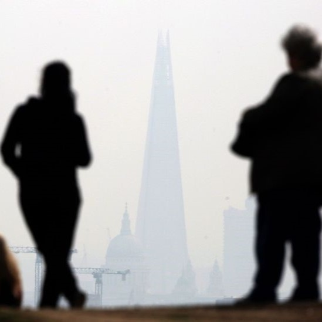

```{r, echo=FALSE, out.width="75%", fig.align = 'center'}

```

## Background
Understanding the patterns of suicide is an essential aspect of public mental health. Consistent monitoring is not just a statistical exercise, it is vital to identifying at-risk groups, disentangling the underlying causes of suicide, and planning suicide prevention efforts. Despite the critical importance of regular surveillance data, there is a paucity of data on suicide rates across ethnic and migrant groups in the UK. 

Recently, Duleeka Knipe and colleagues published updated estimates of suicide rates in England & Wales by ethnic and migrant groups. While this paper is a welcome addition to the literature, it highlights the limitations of existing data. 

Alexandra Pitman, Gonzalo Martínez-Alés, Nathalie Rich and I had the opportunity to review this paper in detail and write a commentary for Lancet Psychiatry. 


## Key discussion points 
We explored the key findings and possible explanations for these patterns. 

### High rates in Mixed and White ethnic groups
For example, Knipes et al (2024) showed higher rates in Mixed and White ethnic groups compared to other minoritised groups and lower rates in migrants compared to UK-born groups. 

It is very difficult to know what these overall rates mean, as there are many possible explanations for these patterns.The finding that suicide rates were higher in Mixed and White ethnic groups could be explained in many ways. For example, do the rates of suicide in minoritised ethnic groups appear to be lower due to systematic under-estimation of suicide rates in minoritised groups. When a suicide death is suspected, the medical examiner or coroner will investigate, and additional information will be considered. This might include looking for prior mental health diagnoses in medical records or identifying if a note was left by the decedent. In the UK, there are different patterns of health care utilisation, where minoritised groups have sparser medical histories and more barriers to health care, particularly mental health care. This may mean that minoritised groups would be less likely to have a prior mental health diagnosis, so their death may be coded as "undetermined" indent. 

### Lower rates in migrant groups
When we looked at the results by migrant status, migrants were much less likely to die by suicide than UK-born individuals. Again, there are many different things that could explain this pattern. A lot of health research has focused on the "healthy migrant effect" where migrants are on average healthier than native-born individuals, which may relate to suicidality as well. However, these low suicide rates may actually be a data artifact as the high mobility of migrants was not considered. There are well-documented patterns of return migration for migrants who become ill or when they experience economic difficulties so they can access health care and other support in their country of origin (sometimes called the Salmon bias). This is relevant to suicide statistics as the data does not capture immigration or emigration of individuals. So migrant may have left the UK, but would appear "statistically immortal" in the UK statistics because they aren't removed from the data set, as they do not have any records of health care usage or death. This would artificially lower rates in migrant groups. 

### What gets measured matters - invisibility in health statistics
Obviously understanding the drivers of suicide patterns is critical to understanding what is happening in different groups over time. However, the most astonishing message of this study is the remarkably limited information on ethnic and migrant inequalities in suicide research in the UK. While the Office for National Statistics have been reporting suicide death rates by sex, age, and region for more than 40 years, these statistics have not been regularly reported for ethnicity or migrant status. Currently, ethnicity and country of birth are not captured at death registration, so we are not able to do similar reports as what is widely available for sex, age, or region. Suicide researchers must rely on linked data, census data, or electronic health records to generate these estimates, which come with their own set of limitations. 

We think this reflects a systemic avoidance of discussing issues of ethnic and migrant disparities in the UK. As epidemiologists and data nerds, we know that "what gets measured matters." When marginalised groups are missing from administrative records, they are rendered invisible in health statistics. As policies and resource allocation depend on available data, the decisions made will not be based on the experiences of minoritised groups. 


## What does this mean?
This descriptive research creates more questions than answers and underlines how little we know about suicide in ethnic and migrant groups in the UK. This high-level descriptive study shows us overarching patterns, but much work is needed to make sense of the observed patterns. In order to move the conversation forward, we emphasise the urgent need for enhanced data collection. 


## Read more
You can read the commentary on [Lancet Psychiatry](https://www.thelancet.com/journals/lanpsy/article/PIIS2215-0366(24)00218-9/fulltext#back-bib3).

You can read the full paper by [Knipe et al., (2024)](https://www.thelancet.com/journals/lanpsy/article/PIIS2215-0366(24)00184-6/fulltext). You might also be interested in related papers by [Isobel Ward et al., (2024)](https://academic.oup.com/eurpub/article/34/2/211/7603331?login=true) or [Danah Alothman et al., (2022)](https://www.sciencedirect.com/science/article/pii/S0165032721012659?via%3Dihub)


## Behind the research
It was a delight to work with [Alexandra](https://profiles.ucl.ac.uk/8825-alexandra-pitman), [Nat](https://profiles.ucl.ac.uk/80231-nathalie-rich), and [Gonzalo](https://www.hsph.harvard.edu/profile/gonzalo-martinez-ales/) on this editorial. They do brilliant psychiatric epidemiological research on ethnic and migrant inequalities and a range of mental health problems, like suicide.  
