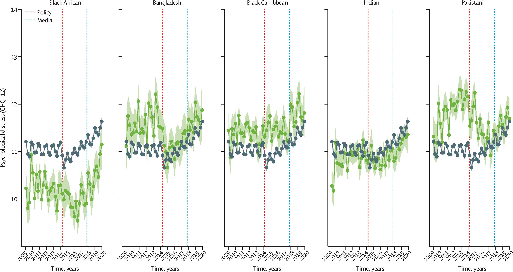

```{r, echo=FALSE, out.width="75%", fig.align = 'center', fig.cap="No Man's Land (1943) by Jankel Adler"}
<<<<<<< HEAD

=======

>>>>>>> 54f70fcd7d52c340e37c92468695a25f7f4375c7
```

## Background
Over the past decade, there have been broad changes to immigration and citizenship policies in the UK. In 2012, a series of policy reforms were introduced, collectively known as the "hostile environment policy." These policies included deputizing landlords, employers, health services, banks, and police to enforce migration rules by checking "right-to-stay" documentation. 

Under these policies, hundreds of Commonwealth citizens who had been legally settled in the UK since the 1950s, many from the Caribbean (the Windrush Generation)  were labeled as undocumented, and some were subject to deportation. By 2017, the UK media began highlighting stories of individuals who lost jobs, benefits, housing under the hostile environment policy, which started to be known as the "Windrush scandal."

## Why did we do this research?
In this study, we investigated whether the hostile environment policy caused mental health problems in people from minoritised ethnic backgrounds. We expected to see an increase in mental health problems and psychological distress among those from Black Caribbean backgrounds following the introduction of the Immigration Act (2014) and subsequent media coverage of the Windrush Scandal (2017), particularly when compared to people of White ethnicity. 

## What did we do? 
We used participants from Understanding Society, the UK Household Longitudinal Study between 2009 and 2020. 

We measured psychological distress, using the General Health Questionnaire (GHQ-12), commonly used to measure symptoms of common mental health problems, like depression and anxiety. 

We used Bayesian interrupted time series analysis to look for differences over 3 time periods: 
- Before the introduction of the Immigration Act (Aug 1, 2009–May 13, 2014)
- Following the introduction of the Immigration Act and before the 2017 media coverage (May 14, 2014–Nov 27, 2017)
- Following media coverage (Nov 28, 2017–March 23, 2020)

We looked at changes in mental health problems in minoritised ethnic groups (
(Black Caribbean, Black African, Indian, or Bangladeshi) and comparison ethnic group (White).

## What did we find?
We found evidence that the UK Government's hostile environment policy and subsequent media coverage of the Windrush scandal caused people of Black Caribbean ethnicities living in the UK to experience greater psychological distress relative to the White ethnicity group.

```{r, echo=FALSE, out.width="75%", fig.align = 'center', fig.cap="Effects of the hostile environment policy on mental ill health across different ethnic groups compared with people of White ethnicity"}

```

## What does this mean? 
Our study shows that political policies can produce, maintain, and exacerbate systemic inequities in population mental health. 

Our findings also show the intersectional ways in which ethnicity, migrant status, and income level combine as structural forces that erode the agency required for affected individuals to achieve equitable levels of mental health to the general population. 

Ultimately, governments should ensure that future policies are not implemented without consideration of the effects they could have on public mental health, via a population mental health impact assessment that quantifies the potential effect (negative or positive) that any policy could have on overall levels of public mental health or on exacerbating or reducing inequalities by ethnicity or any other protected characteristic.

## Read more
You can read the full, open-access paper [Lancet Psychiatry ](https://www.thelancet.com/journals/lanpsy/article/PIIS2215-0366(23)00412-1/fulltext). 
<<<<<<< HEAD

A summary can be also found on[Medical Xpress](https://medicalxpress.com/news/2024-02-hostile-environment-policies-linked-prolonged.html). If you are lucky, you may catch Annie Jeffery's interview on LBC morning radio.  
=======
>>>>>>> 54f70fcd7d52c340e37c92468695a25f7f4375c7

## Behind the research
This analysis was led [Dr Annie Jeffery](https://profiles.ucl.ac.uk/74470-annie-jeffery), a post-doc in [Prof James Kirkbride](https://profiles.ucl.ac.uk/43555)'s PsyLife Lab at UCL and a crew of brilliant statisticians and experts in Bayesian analysis and causal inference. 
