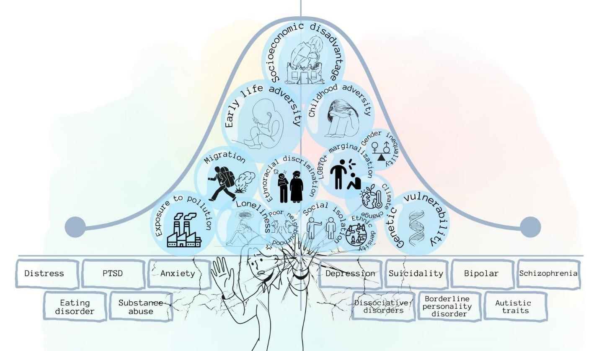

```{r, echo=FALSE, out.width="75%", fig.align = 'center', fig.cap=""}

```

## Why did we do this research?


## Read more
This article has been published at [BMC Public Health]()

## Behind the research
This review was conducted as part of the [School for Public Health Research's Public Mental Health Programme]. We conducted several similar reviews to explore outcome measures in mental health. 

We also developed a [PMH conceptual framework](www.publicmentalhealth.co.uk) to summarise the determinants of public mental health , which was linked to this 


