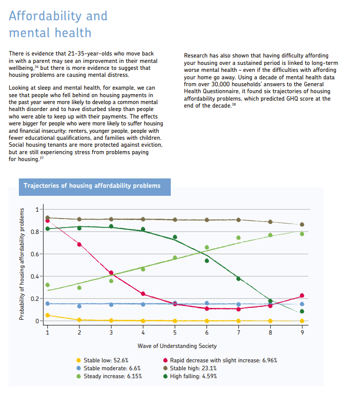

```{r setup, include=FALSE}
knitr::opts_chunk$set(echo = TRUE)

library("rmarkdown")
library("yaml")
library("blogdown")
library("knitr")
library("blogdown")

blogdown::install_hugo

```


```{r, echo=FALSE, out.width="75%", fig.align = 'center', fig.cap="Understanding Society Insight 2025 report: transforming housing"}
knitr::include_graphics("featured.png")
```

### Background

Each year, Understanding Society (USoc) releases an in-depth report on a policy-relevant topic. For their 2025 report, they chose to focus on housing. This is particularly timely, as the UK has been facing a housing crisis. USoc's rich longitudinal data is well-suited for exploring questions around housing affordability, suitability, and intersections with inequality, poverty, and differential impacts on marginalised groups. 

Our recent paper on housing affordability was featured as part of this report (page 28), describing how experiences of housing affordability problems are linked to long-term mental health issues.

```{r, echo=FALSE, out.width="75%", fig.align = 'center', fig.cap="USoc Insight report"}

```


I was delighted to be invited to present at the Insights 2025 conference at the British Academy, which brought together policy makers, researchers, and members of the public to discuss how housing is fundamental to creating healthy, equitable, and sustainable communities. 


### Read more

You can find the Insights 2025 report [here - Understanding Society](https://www.understandingsociety.ac.uk/research/findings/).
You can read the full paper [here - Social Psychiatry and Psychiatric Epidemiology](https://link.springer.com/article/10.1007/s00127-022-02314-x) or summarised in [this post](https://www.mentalhealthepi.com/blog/2022-housing-traj/).

