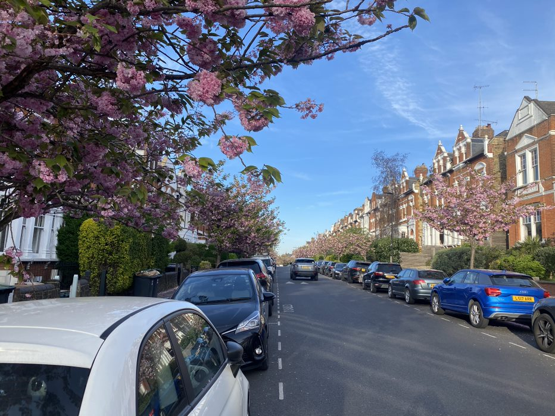

```{r, echo=FALSE, out.width="100%", fig.align = 'center', fig.cap=" "}

```

Improving public mental health, promoting well-being, and preventing mental illness is a major priority for public health in the UK. Importantly, communities can play an important role in providing public mental health interventions which target key determinants of mental health. 

Part of our research within the [NIHR School for Public Health Research's Public Mental Health Programme](https://sphr.nihr.ac.uk/category/research/public-mental-health/), was mapping map community-based mental health interventions, with the goal of summarising the range of interventions currently offered, review the key features of each intervention, including any evaluations, and to explore the distribution of service offerings in light of data of need in the UK. 


This work was lead by Dr Fiona Duncan (Durham University) and Michael McGrath (UCL), with support from across the Public Mental Health Programme. Our paper was published last year in [BMC Public Health - open access](https://bmcpublichealth.biomedcentral.com/articles/10.1186/s12889-021-11741-5)

Normally I would jump into a brief summary of what we did, what we found, and why it matters, but the [Mental Elf](https://www.nationalelfservice.net/mental-health/) published a terrific summary of this work on their blog today. 

Read the clear summary by Mental Elf Elena Opie here, including limitations and next steps of this research: [A map of England's community mental health interventions: are we meeting people's needs?](https://www.nationalelfservice.net/populations-and-settings/community-settings/community-mental-health-england/)

